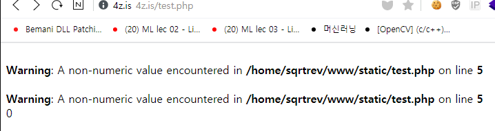
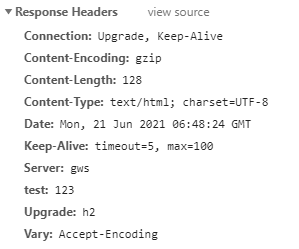
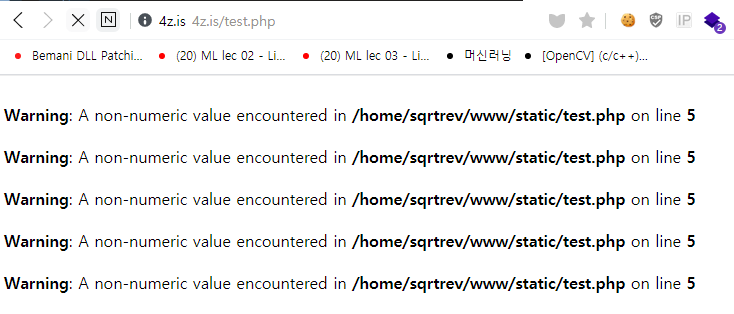
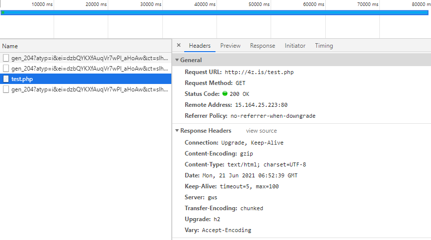
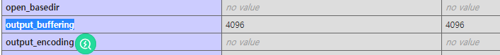

# PHP Output Buffering Analysis

### The Ideas (Guessing)

- Imagine that code allocates memory for header by following `php.ini`
- Maybe PHP will communicate over socket also. So, assume that socket send only fixed bytes following `php.ini`
- Assume that PHP stores response as a temporary file. When PHP send it, it only reads n bytes from temporary file by following `php.ini`
- If the stored buffer size reached limit, PHP will send this first.


### Review Error

```
PHP Warning:  Cannot modify header information - headers already sent by (output started at /home/sqrtrev/www/static/just.php:23) in /home/sqrtrev/www/static/just.php on line 34
```

output started at just.php, line 23 which is below.

```php
$_nonce = hash("aaaaaaaaaaaaaaaaaaaaaaaaaaaaaaaaaaaaaaaaaaaaaaaaaaaaaaaaaaaaaaaaaaaaaaaaaaaaaaaaaaaaaaaaaaaaaaaaaaaaaaaaaaaaaaaaaaaaaaaaaaaaaaaaaaaaaaaaaaaaaaaaaaaaaaaaaaaaaaaaaaaaaaaaaaaaaaaaaaaaaaaaaaaaaaaaaaaaaaaaaaaaaaaaaaaaaaaaaaaaaaaaaaaaaaaaaaaaaaaaaaaaaaaaaaaaaaaaaaaaaaaaaaaaaaaaaaaaaaaaaaaaaaaaaaaaaaaaaaaaaaaaaaaaaaaaaaaaaaaaaaaaaaaaaaaaaaaaaaaaaaaaaaaaaaaaaaaaaaaaaaaaaaaaaaaaaaaaaaaaaaaaaaaaaaaaaaaaaaaaaaaaaaaaaaaaaaaaaaaaaaaaaaaaaaaaaaaaaaaaaaaaaaaaaaaaaaaaaaaaaaaaaaaaaaaaaaaaaaaaaaaaaaaaaaaaaaaa", $nonce);
```

Such error means, the output is started with `PHP Warning` and there is a possibility that error is treat as an header (Idea 1) or if `PHP Warning` exists, PHP sends error to client first (Idea 2).


Test 1:

```php
<?php
ini_set('display_errors',true);

echo 'sqrt'+'rev';

header("test: 123");
?>
```





the result showed me that PHP didn't send error first even there is error. So, Idea 2 is wrong.


Test 2:

```php
<?php
ini_set('display_errors',true);

for($i = 0; $i < 0xffff; $i++)
        $tmp = 'sqrt'+'rev';

header("test: 123");
?>
```







There is very interesting result with this. When I accessed test page, there is no header `test: 123` and also, check the loading time bar. It's in progress and my page is getting errors more and more. This means if the amount of error is bigger than `output_buffering`, PHP sends outputs and keeps rendering additional pages via Keep-Alive (I guess). By the way, the browser treats first response header as page's header. So, additional header will be ignored.


### Analysis

- STD_PHP_INI_ENTRY
- The error, `Cannot modify header information - headers already sent by`
- - from `main/SAPI.c`
  - at function `SAPI_API int sapi_header_op(sapi_header_op_enum op, void *arg)`
  - Firstly, checks `sapi_globals.headers_sent` and `sapi_globals.request_info.no_headers`
  - call `php_output_get_start_filename()` and check if this exists.
  - exists -> header sent error with file name + line
  - non_exists -> header sent error without any additional information
- Key point is `sapi_globals.headers_sent` and `sapi_globals.request_info.no_headers` maybe..? Not sure
- The function, `sapi_send_headers`, set `sapi_globals.headers_sent` as `1`
- this function is called from `sapi/apache2handler/sapi_apache2.c`'s `php_apache2_sapi_flush` function
- - this function set `sapi_globals.headers_sent` as 1 also
  - there is a static variable named `apache2_sapi_module` which contains this function
- it looks like error is handled with another way. Need to check
- `Unknown hashing algorithm` from `ext/hash/hash.c`
- - used `php_error_docref` function for trigger an error message
  - which is defined at `main/main.c` and it calls `php_verror` function locally.
  - `php_error` is `zend_error` (defined as macro)
  - `zend_error` is defined at `Zend/zend.c` and calls `zend_error_va_list`
  - calls `zend_error_cb` which is defined in the function `zend_startup`
  - which function is called in `main.c` -> `zend_startup(&zuf)`
  - `zuf.error_function = php_error_cb`
  - `php_error_cb` calls `php_log_err_with_severity`
  - `php_log_err_with_severity` calls `sapi_module.log_message`
  - `sapi_module` defined in `sapi/SAPI.c` -> function `sapi_startup`
  - `php_apache_server_startup` defined in `sapi/apache2handler/sapi_apache2.c` calls `sapi_startup`
  - `sapi_startup(&apache2_sapi_module)` -> `apache2_sapi_module.log_message` = `php_apache_sapi_log_message`

  - `php_apache_sapi_log_message` calls `ap_log_error` or `ap_log_rerror`
  - https://ci.apache.org/projects/httpd/trunk/doxygen/group__APACHE__CORE__LOG.html#ga83397d991e162cb611864767c1bc0c54
  - https://ci.apache.org/projects/httpd/trunk/doxygen/group__APACHE__CORE__LOG.html#ga7b7009cfaad5a84be316e523d7ef1236
  - `ap_log_rerror(file, level, status, r, fmt)`
  - It looks like here is just for the logging the errors. move to other code.
- `php_request_startup(void)` at `main.c` calls `php_output_start_user(NULL, PG(output_buffering), PHP_OUTPUT_HANDLER_STDFLAGS)`
- - which code is below

```c
PHPAPI int php_output_start_user(zval *output_handler, size_t chunk_size, int flags)
{
	php_output_handler *handler;

	if (output_handler) {
		handler = php_output_handler_create_user(output_handler, chunk_size, flags);
	} else {
		handler = php_output_handler_create_internal(ZEND_STRL(php_output_default_handler_name), php_output_handler_default_func, chunk_size, flags);
	}
	if (SUCCESS == php_output_handler_start(handler)) {
		return SUCCESS;
	}
	php_output_handler_free(&handler);
	return FAILURE;
}
```

```c
PHPAPI php_output_handler *php_output_handler_create_internal(const char *name, size_t name_len, php_output_handler_context_func_t output_handler, size_t chunk_size, int flags)
{
	php_output_handler *handler;
	zend_string *str = zend_string_init(name, name_len, 0);

	handler = php_output_handler_init(str, chunk_size, (flags & ~0xf) | PHP_OUTPUT_HANDLER_INTERNAL);
	handler->func.internal = output_handler;
	zend_string_release_ex(str, 0);

	return handler;
}
```

```c
static inline php_output_handler *php_output_handler_init(zend_string *name, size_t chunk_size, int flags)
{
	php_output_handler *handler;

	handler = ecalloc(1, sizeof(php_output_handler));
	handler->name = zend_string_copy(name);
	handler->size = chunk_size;
	handler->flags = flags;
	handler->buffer.size = PHP_OUTPUT_HANDLER_INITBUF_SIZE(chunk_size);
	handler->buffer.data = emalloc(handler->buffer.size);

	return handler;
}
```

```c
#define PHP_OUTPUT_HANDLER_INITBUF_SIZE(s) \
( ((s) > 1) ? \
	(s) + PHP_OUTPUT_HANDLER_ALIGNTO_SIZE - ((s) % (PHP_OUTPUT_HANDLER_ALIGNTO_SIZE)) : \
	PHP_OUTPUT_HANDLER_DEFAULT_SIZE \
)
```

So, `handler->buffer.size = (output_buffering + 0x1000 - (output_buffering % 0x1000))`

Assume the output_buffering is `4096`(default setting), the `buffer.size` must be 8192.

Following above process, `buffer.data` will have 8192 free bytes.


